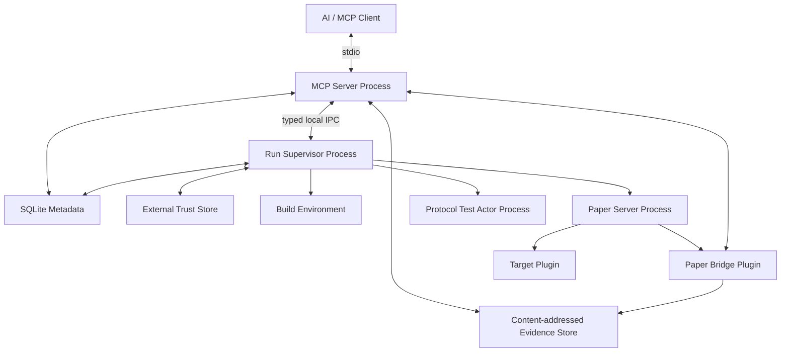

# Deployable process topolojisi

Karar kaydı: [`../adr/0001-process-topology.md`](../adr/0001-process-topology.md)

## Deployable process'ler

1. **MCP Server Process**
2. **Run Supervisor Process**
3. **Paper Server Process**
4. **Protocol Test Actor Process** — yalnızca M2B capability'leri için

## Ayrı process olmayan bileşenler

| Bileşen | Nerede yaşar |
|---|---|
| Paper Bridge | Paper process'i içinde çalışan **Java eklentisi** |
| Policy Engine | MCP Server modülü |
| Scenario Coordinator | MCP Server modülü |
| Schema Registry | MCP Server modülü |
| Evidence API | MCP Server modülü |
| Build Executor | Run Supervisor modülü |
| Source Snapshotter | Run Supervisor modülü |
| Runtime Registry | Run Supervisor modülü |
| Operation Ledger | Run Supervisor modülü |
| Garbage Collector | Run Supervisor modülü |

---

## MCP Server Process

Modüller: MCP transport · Stable Tool Facade · Schema Validator · Policy Engine · Scenario Coordinator · Resource/Evidence API · Domain error mapper · Trace propagation · Client compatibility layer.

MCP Server **yapmaz**:

- doğrudan shell çalıştırmaz,
- doğrudan Paper process sahipliği taşımaz,
- doğrudan runtime klasörü silmez,
- stdout'a protokol dışı veri yazmaz.

## Run Supervisor Process

Modüller: Project Registry · Trust Store client · Source Snapshotter · Execution Backend manager · Build Executor · Runtime Registry · Process Ownership Manager · Operation Ledger · Mutation Ledger · Retention Manager · Garbage Collector · Startup Recovery.

**Zorunlu davranış:** Supervisor, MCP Server çöktüğünde de process ownership bilgisini korur ve yeniden başlatıldığında startup recovery çalıştırır.

## Paper Server Process

İçerir: Paper JAR · Paper Bridge · hedef plugin · test dependency plugin'leri · fixture dünya · deterministik config.

Paper process'i **disposable** kabul edilir. V1'de plugin hot reload kullanılmaz.

## Protocol Test Actor

- Ayrı process
- Yalnızca test runtime'a bağlanır
- **Gerçek kullanıcı hesabı veya production credential taşımaz**
- CI uyumlu offline test identity kullanır
- Capability negotiation ile desteklenen eylemleri bildirir
- Actor spike başarısızsa M2B V1'den çıkar
