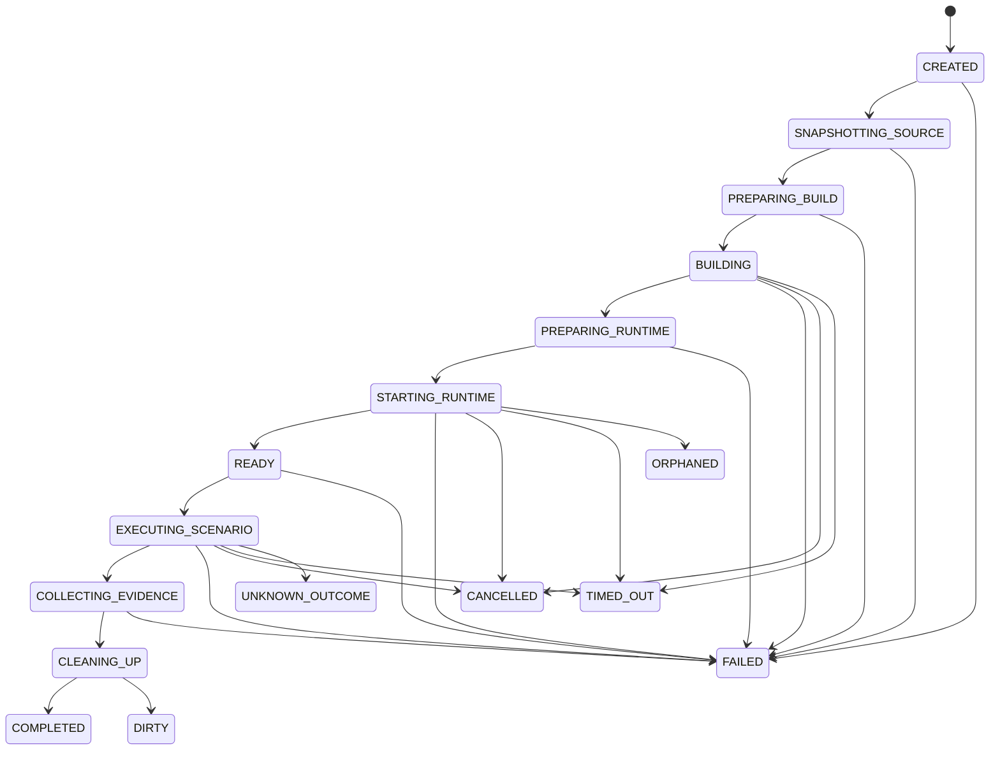
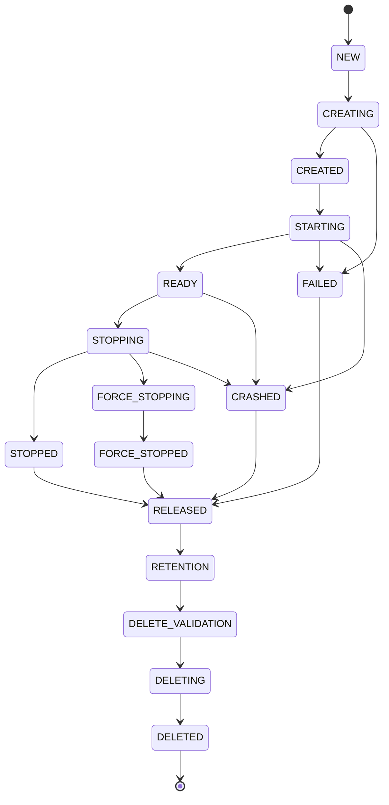

# Durum makineleri

> **D0C kilidi (2026-08-07):** Bu durum makineleri Architecture Freeze itibarıyla **donmuştur**. Yeni durum veya geçiş ADR gerektirir; terminal durumların anlamları `UNKNOWN_OUTCOME` semantiği (kör retry yasağı) ve `DIRTY` (KPI-12) ile birlikte değiştirilemez.

## Run



Terminal durumlar: `COMPLETED` · `FAILED` · `CANCELLED` · `TIMED_OUT` · `DIRTY` · `ORPHANED` · `UNKNOWN_OUTCOME`

| Terminal durum | Anlam |
|---|---|
| `COMPLETED` | Akış bitti; scenario sonucu ayrı alanda taşınır |
| `FAILED` | Beklenen bir hata sınıfı; kod + suggested action taşır |
| `CANCELLED` | Kullanıcı/agent iptali |
| `TIMED_OUT` | Limit aşımı |
| `DIRTY` | Ana iş bitti fakat **cleanup başarısız** — ana sonucu gizlemez (KPI-12) |
| `ORPHANED` | Sahipsiz process tespit edildi; recovery gerekir |
| `UNKNOWN_OUTCOME` | Sonucun uygulanıp uygulanmadığı bilinmiyor; **otomatik retry edilmez** |

## Operation

```text
CREATED
  -> QUEUED
  -> RUNNING
  -> SUCCEEDED | FAILED | TIMED_OUT
  -> CANCELLING
  -> CANCELLED | FAILED
```

## Runtime



**Karar:** Agent `DELETING` işlemi başlatamaz. `RETENTION -> DELETE_VALIDATION -> DELETING` geçişleri yalnızca Garbage Collector tarafından, dry-run validation sonrasında yapılır.

## Scenario

```text
VALIDATING
  -> PREPARING
  -> EXECUTING_GIVEN
  -> EXECUTING_WHEN
  -> ASSERTING
  -> COLLECTING_EVIDENCE
  -> CLEANING_UP
  -> PASSED | FAILED | CANCELLED | TIMED_OUT | DIRTY
```

Cleanup **her** terminal durumda denenir; cleanup sonucu scenario sonucundan ayrı raporlanır.

## Mutation

```text
RECEIVED
  -> VALIDATED
  -> SCHEDULED
  -> APPLYING
  -> APPLIED | FAILED | UNKNOWN_OUTCOME
```

`UNKNOWN_OUTCOME` durumunda agent önce mutation status sorgular; kör retry yasaktır.
