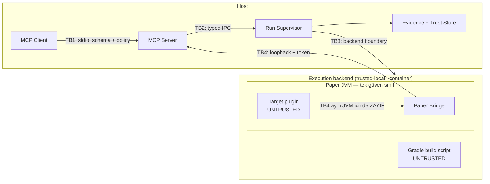

# Threat model

Karar kaydı: [`../adr/0007-security-claims.md`](../adr/0007-security-claims.md)

## Güvenlik sınıfları

| Sınıf | Tanım | V1 davranışı |
|---|---|---|
| T0 | Güvenilir geliştirici workspace'i | Trusted Local veya Container |
| T1 | AI üretimli, hatalı fakat kötü niyetli olmayan kod | Container önerilir |
| T2 | Kötü niyetli build script veya plugin | Yalnızca strong isolation hedefi |
| T3 | Host escape veya kernel exploit girişimi | **V1 garanti etmez** |
| T4 | Canlı production ortamı | **V1 kapsam dışı** |

Ürünün asıl tasarım hedefi **T0 ve T1**'dir. T2 için Container backend zorunludur ve kanıt bütünlüğü mutlak garanti olarak sunulmaz. T3 ve T4 için hiçbir iddia yoktur.

## Aktörler

| Aktör | Konum | Güven |
|---|---|---|
| MCP Client (AI ajanı) | Host | Yarı güvenilir — istek üretir, yetki üretmez |
| MCP Server | Host | Güvenilir — policy noktası |
| Run Supervisor | Host | Güvenilir — ownership noktası |
| Build script (Gradle) | Execution backend | **Güvenilmez** |
| Hedef plugin | Paper JVM | **Güvenilmez** |
| Paper Bridge | Paper JVM | Güvenilir kod, **güvenilmez komşu** |
| Protocol Test Actor | Host / backend | Güvenilir kod, gerçek credential taşımaz |

## Güven sınırları

| Sınır | Ne korur | Ne korumaz |
|---|---|---|
| **TB1** MCP Client → Server | Şema dışı girdi, kapsam dışı tool, mutlak path, yetkisiz handle | Ajanın kötü niyetli *ama geçerli* istekler üretmesini (policy + risk metadata ile sınırlandırılır) |
| **TB2** MCP Server → Supervisor | Serbest komut yürütme, sahiplik karışması | — |
| **TB3** Supervisor → backend | Host FS/ağ/secret erişimi (Container'da) | Trusted Local'da host izolasyonu **sağlanmaz** |
| **TB4** Bridge → MCP | Rastgele localhost process'leri, DNS rebinding, yanlış runtime, kazara erişim | **Aynı JVM içindeki aktif kötü niyetli hedef plugin** |

## Ana saldırı senaryoları ve kontroller

| # | Senaryo | Kontrol | Test |
|---|---|---|---|
| A1 | Build script host FS'i okur/yazar | Container: read-only source mount, disposable workspace, host secret yok | `ST-CONTAINER-FS-001` |
| A2 | Build script ağ üzerinden veri sızdırır | Reproducible mod: ağ kapalı, `--offline`; Container: default deny | `ST-CONTAINER-NET-001` |
| A3 | Bağımlılık zinciri ele geçirilir | Lock file + `verification-metadata.xml` strict + wrapper JAR checksum + SBOM | `ST-GRADLE-001..007` |
| A4 | Kötü niyetli wrapper JAR | Wrapper JAR checksum verification, `distributionUrl` allowlist | `ST-GRADLE-004` |
| A5 | Hedef plugin Bridge token'ını okur | **Kabul edilen limitation.** Kontrol: Container izolasyonu + kanıt caveat'ı | `ST-SAMEJVM-001` |
| A6 | Hedef plugin evidence dosyalarını değiştirir | Content-addressed store host tarafında; Bridge yazdığı evidence checksum'lanır | `ST-SAMEJVM-002` |
| A7 | Path traversal / symlink / junction ile runtime dışına yazma | Canonical path confinement, reparse point denetimi, runtime marker dosyası | `ST-PATH-001..004` |
| A8 | Archive traversal / zip bomb | Extraction traversal testi, sıkıştırma oranı limiti | `ST-ARCHIVE-001..002` |
| A9 | Shell metacharacter / Gradle arg injection | Shell kullanılmaz; process argüman dizisiyle başlatılır; task allowlist | `ST-PROC-001..002` |
| A10 | Sahipsiz process / port kalması | Process group (Linux) / Job Object (Windows), Supervisor registry, startup recovery | `ST-CLEANUP-001..003` |
| A11 | Bilinmeyen PID'in öldürülmesi | PID + executable + start time + runtime marker fingerprint eşleşmesi zorunlu | `ST-PROC-003` |
| A12 | Secret'ın log/rapora sızması | Redaction profili, token TTL, `handle_ttl_minutes`, raw host path yasağı | `ST-REDACT-001..003` |
| A13 | Tarayıcıdan Bridge'e istek (DNS rebinding) | Loopback bind + Host/Origin doğrulaması + token | `CT-BRIDGE-AUTH-001..003` |
| A14 | Yanlış runtime'a mutation | `server_instance_id` + `bridge_boot_id` eşleşmesi, event cursor mismatch hatası | `CT-BRIDGE-004` |
| A15 | Mutation'ın kör retry ile iki kez uygulanması | Idempotency key + argument hash; `UNKNOWN_OUTCOME` otomatik retry edilmez | `CT-IDEMPOTENCY-001..003` |
| A16 | Kaynak build sırasında değişir | Snapshot fingerprint; `SOURCE_CHANGED_DURING_BUILD` | `ST-SNAPSHOT-001` |
| A17 | Kötü niyetli oyuncu metni rapora enjekte edilir | Event/mesaj alanları veri olarak işlenir, şablon olarak yorumlanmaz | `ST-INJECT-001` |
| A18 | MCP Server çöker, Paper sahipsiz kalır | Ownership Supervisor'da; startup recovery | `ST-RECOVERY-001` |

## Açıkça kabul edilen limitationlar

Bu maddeler hata değil, **belgelenmiş sınırlardır**:

1. `trusted-local` backend kötü niyetli Java/Gradle koduna karşı host izolasyonu sağlamaz.
2. Bridge auth, aynı Paper JVM'i içindeki aktif kötü niyetli hedef plugin'e karşı güvenlik sınırı değildir.
3. T3 (host escape, kernel exploit) V1 kapsamında garanti edilmez.
4. Hedef plugin aktif saldırgan kabul edildiğinde tam kanıt bütünlüğü garanti edilmez.

Ayrıntı: [`guarantees.md`](guarantees.md).
